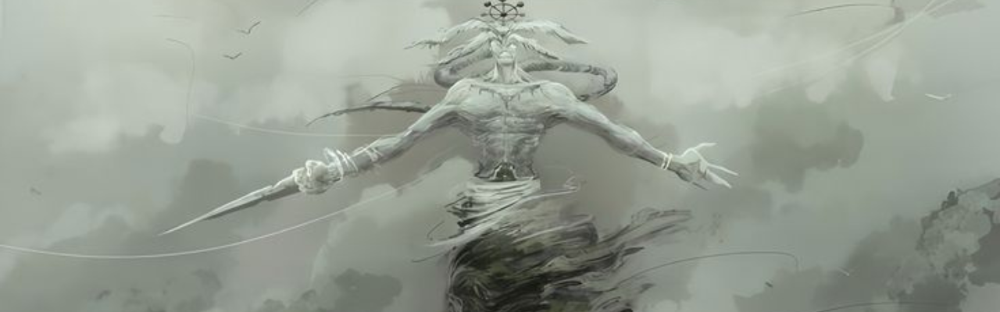
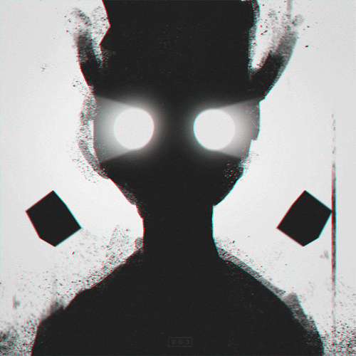

<div align="center">



### *"i didn't come this far to only come this far."*

</div>

---

<div align="center">

```
student by day · AI tinkerer by night · robotics enthusiast always
```

</div>

---

### ◈ about

<table>
<tr>
<td width="35%" align="center">

</td>
<td width="65%" valign="top">

```python
0xkrxn = {
    "age"      : 16,
    "status"   : "student by day, AI tinkerer by night",
    "obsessed" : ["AI", "Robotics", "Python"],
    "tools"    : ["Claude", "ChatGPT", "Perplexity"],
    "learning" : "how to make machines think",
    "honest"   : True,
}
```

> i'm 16 and i stopped waiting to be "old enough" to build real things.  
> i talk to AI more than most people talk to their friends.  
> that's either a superpower or a red flag — i choose superpower.

</td>
</tr>
</table>

---

### ◈ stack

<div align="center">


</div>

---

### ◈ stats

<div align="center">


</div>

---

### ◈ reach me

<div align="center">

[](https://instagram.com/YOUR_INSTAGRAM)
[](https://discord.com/users/YOUR_DISCORD_ID)

</div>

---

<div align="center">


</div>
